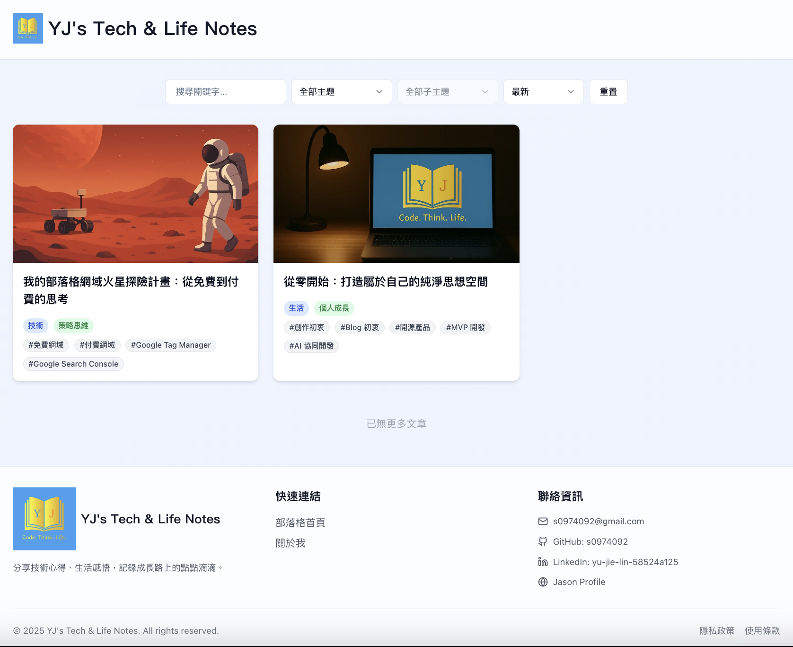

[](./README.md) [](./README.zh-TW.md) [](./README.zh-CN.md)

# YJ's Tech & Life Notes - 博客网站

[](LICENSE)
[](CODE_OF_CONDUCT.zh-CN.md)
[](CONTRIBUTING.zh-CN.md)
[](https://github.com/s0974092/blog/actions/workflows/dependency-check.yml)
[](https://github.com/s0974092/blog/actions/workflows/security.yml)
[](https://github.com/s0974092/blog/actions/workflows/tests.yml)
[](https://github.com/s0974092/blog/actions/workflows/ci.yml)
[](https://yj-jason-blog.vercel.app)

一个使用 Next.js 15、TypeScript、Tailwind CSS 和 Supabase **快速且低成本**搭建专业博客，前端静态化、后台私有化，专注内容创作，轻松管理。

你也可以快速建立一个如同 [YJ's Tech & Life Notes](https://yj-jason-blog.vercel.app) 的博客系统。



⭐ 如果这个项目对您有帮助，请给我们一个 Star！

## 🚀 功能特色

- 📝 富文本编辑器（基于 Slate.js）
- 🎨 现代化响应式设计
- 🔍 全文搜索功能
- 📱 移动设备优化
- 🔐 安全的身份验证
- 📊 内容管理系统

## 🛠️ 技术栈

- **前端框架**: Next.js 15 (React 19)
- **编程语言**: TypeScript
- **样式框架**: Tailwind CSS
- **数据库**: Supabase (PostgreSQL)
- **编辑器**: Slate.js + Yoopta
- **UI 组件**: Radix UI
- **动画**: Framer Motion
- **表单处理**: React Hook Form + Zod

## 📦 开源许可证

本项目采用 **MIT 许可证**，这意味着：

✅ **您可以自由使用** - 用于个人或商业项目  
✅ **您可以修改** - 根据需求调整代码  
✅ **您可以分发** - 分享给其他人使用  
✅ **您可以商业使用** - 无需支付授权费用  

唯一的条件是保留原始的版权声明和许可证声明。

更多关于许可证的详细分析，请参考 [开源许可证分析报告](docs/license_analysis.md)。


## 🔧 安装与运行

### 前置需求

- Node.js 18+ 
- npm 或 yarn
- Supabase 帐户
- Vercel 帐户

### 安装步骤

```bash
# 克隆项目
git clone https://github.com/s0974092/blog.git
cd blog

# 安装依赖
npm install

# 注意：`npm install` 会自动执行 `npx prisma generate` 来生成 Prisma Client。若您手动修改了 `prisma/schema.prisma` 文件，请记得执行 `npx prisma generate` 来更新 Client。

# 设置环境变量
# 请参考 `.env.example` 文件来设置您的环境变量。复制此文件为 `.env.local` 并填入您的设置。
cp .env.example .env.local
# 编辑 .env.local 文件，填入您的 Supabase 设置
# 未来部署至Vercel或其他相似平台时，需填入对应的环境变量与数值

# 运行开发服务器
npm run dev
```

### 数据库设置

关于数据库的初始化、迁移、Seed 填充以及 RLS (Row-Level Security) 设置的详细说明，请参考 [数据库设置指南](docs/database-setup-guide.md)。

### 本机 CI 检查

在推送代码到 GitHub 之前，您可以在本机运行检查以确保 CI/CD 流程能够顺利通过。更多详细信息，请参考 [本机开发检查指南](docs/local-dev-troubleshooting.md)。

### 更多文件

以下是项目中其他重要文件的链接，提供更深入的技术细节和开发指南：

*   [后台功能文件](docs/backend-features.md)
*   [前台功能文件](docs/frontend-features.md)
*   [Next.js 缓存策略](docs/nextjs-caching-strategies.md)

## 📁 项目结构

```
blog/
├── app/                         # Next.js App Router
│   ├── (public)/                # 公开页面路由组
│   │   ├── about/               # 关于我页面
│   │   │   ├── layout.tsx       # 页面布局
│   │   │   └── page.tsx         # 页面内容
│   │   ├── blog/                # 博客页面
│   │   ├── privacy/             # 隐私政策页面
│   │   │   ├── layout.tsx       # 页面布局
│   │   │   └── page.tsx         # 页面内容
│   │   ├── terms/               # 使用条款页面
│   │   │   ├── layout.tsx       # 页面布局
│   │   │   └── page.tsx         # 页面内容
│   │   └── login/               # 登录页面
│   ├── (admin)/                 # 管理后台路由组
│   │   ├── dashboard/           # 仪表板
│   │   ├── posts/               # 文章管理
│   │   ├── categories/          # 分类管理
│   │   ├── sub-categories/      # 子分类管理
│   │   ├── tags/                # 标签管理
│   │   └── layout.tsx           # 管理后台布局
│   ├── api/                     # API 路由
│   ├── layout.tsx               # 根布局
│   ├── page.tsx                 # 首页
│   ├── providers.tsx            # 全局提供者
│   ├── robots.ts                # 搜索引擎优化
│   └── sitemap.ts               # 网站地图
├── components/                  # React 组件
│   ├── ui/                      # 基础 UI 组件
│   ├── blog/                    # 博客相关组件
│   ├── post/                    # 文章相关组件
│   ├── category/                # 分类相关组件
│   ├── sub-category/            # 子分类相关组件
│   ├── tag/                     # 标签相关组件
│   └── layout/                  # 布局组件
│       ├── public/              # 公开页面布局
│       │   ├── Header.tsx       # 页面标题
│       │   ├── Footer.tsx       # 页面底部
│       │   └── PublicLayout.tsx # 公开页面布局
│       └── admin/               # 管理后台布局
├── lib/                         # 工具函数和设置
│   ├── utils.ts                 # 通用工具函数
│   ├── constants.ts             # 常数定义
│   ├── auth.ts                  # 身份验证相关
│   ├── server-auth.ts           # 服务器端身份验证
│   ├── supabase.ts              # Supabase 设置
│   └── prisma.ts                # Prisma 设置
├── prisma/                      # 数据库相关
│   ├── schema.prisma            # 数据库结构定义
│   └── migrations/              # 数据库迁移文件
├── public/                      # 静态资源
│   ├── images/                  # 图片资源
│   └── yj-brand-logo.png        # 品牌标志
├── LICENSE                      # MIT 许可证
├── README.md                    # 项目说明文件
└── package.json                 # 项目依赖配置
```

## 🤝 贡献指南

我们欢迎社区贡献！更多详细信息，请参考 [贡献指南](CONTRIBUTING.zh-CN.md)。

## 📜 行为准则

我们希望所有贡献者都能遵守我们的 [行为准则](CODE_OF_CONDUCT.zh-CN.md)。在参与本项目之前，请花时间阅读它。

## 📄 许可证详情

本项目使用 MIT 许可证 - 详见 [LICENSE](LICENSE) 文件。

## 📞 联系信息

- **电子邮件**: s0974092@gmail.com
- **GitHub**: [@s0974092](https://github.com/s0974092)
- **项目地址**: [YJ's Tech & Life Notes](https://github.com/s0974092/blog)

## 🙏 致谢

感谢所有开源项目的贡献者，特别是：

- [Next.js](https://nextjs.org/) - React 框架
- [Supabase](https://supabase.com/) - 后端即服务
- [Tailwind CSS](https://tailwindcss.com/) - CSS 框架
- [Radix UI](https://www.radix-ui.com/) - UI 组件库
- [Slate.js](https://docs.slatejs.org/) - 富文本编辑器框架